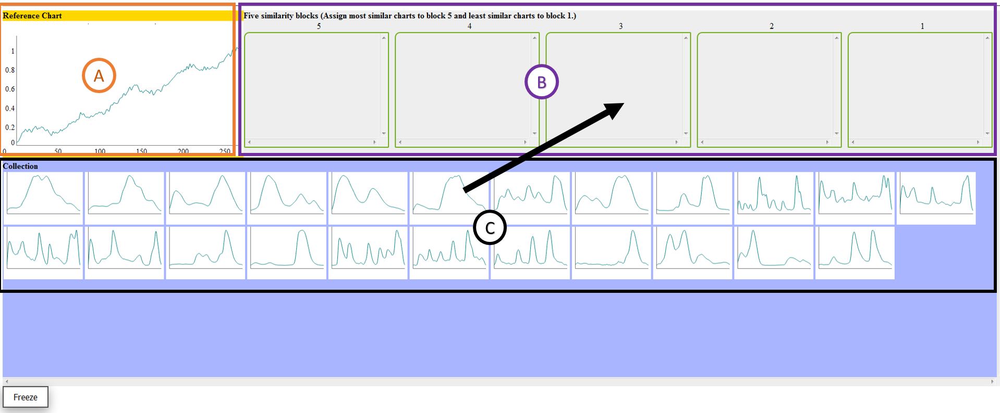

# 
Instruction

### General introduction:
In this HIT, you will be asked to rate a set of time series based on their similarity with a given time series (query). Then you will answer several questions about the rating process. The set of time series is in **Data collection** block and the query time series is in **Query** block. You have to assign the time series in the collection to different bins in the **Five similarity bins** block based on their similairty to the query.

****
### Step by step:

Please read the following instructions and then click *OK* to begin the task:

1. Given the **Query** and **Data collection**, drag the time series in **Data collection** block to different bins in **Five similarity bins** block based on the similarity to the query (1 for least similar; 5 for most similar). You can also see larger charts when you hover on the time series both in the **Data collection** block and the **Similarity bins** block.

2. You MUST assign ALL the time series in the data collection to the similairty bins you seem appropriate. You can also move a time series from one similairty bin to another if required.

3. After the assigment is complete, click the *Freeze* button to freeze the task. You will NOT be able to make any changes to similairty bins once the task is freezed. But you can still see the larger images by hovering on the charts in the bins.

4. After clicking *Freeze*, you will see serveral questions related to the rating task. Once you answer all the questions, you can click *Submit* to upload your results.

****
